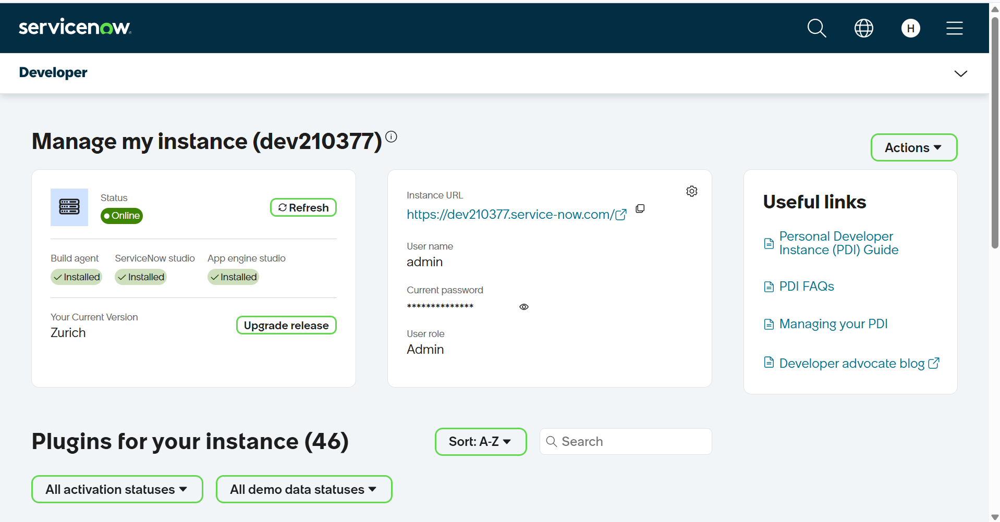
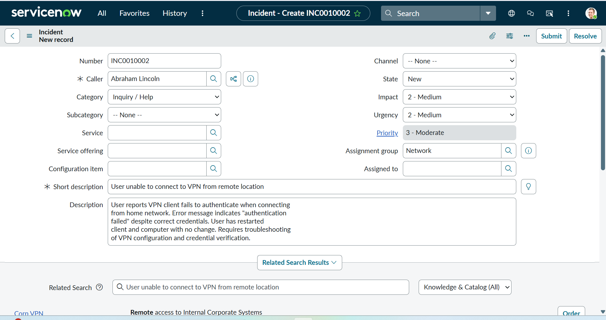
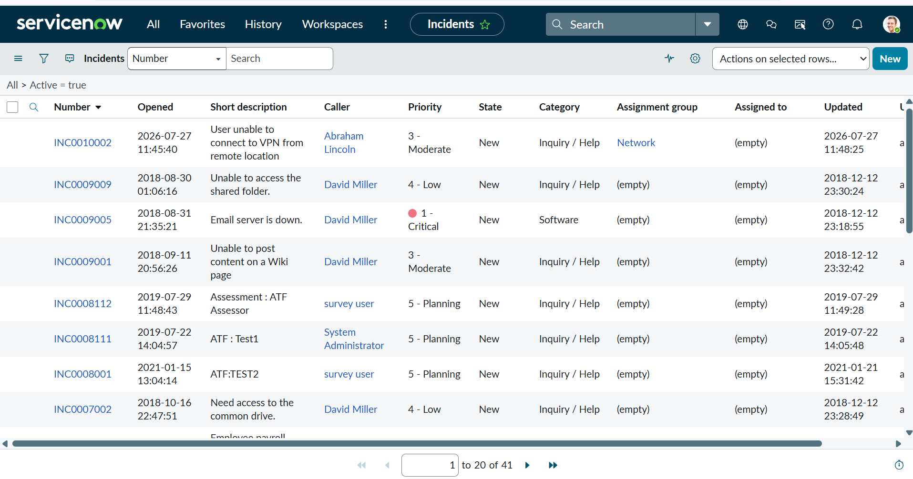
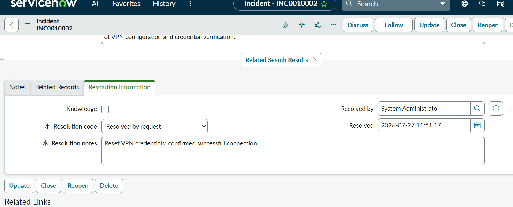
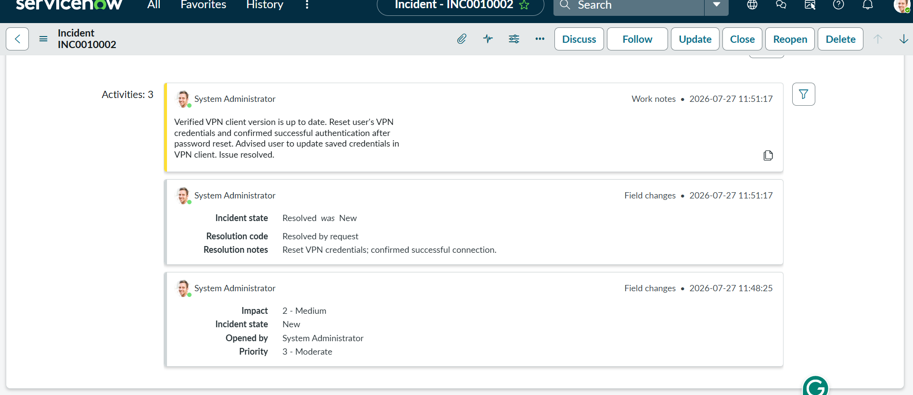

# ServiceNow ITSM Lab

Hands-on incident management demonstration using a ServiceNow Personal Developer Instance (Zurich release).

## Overview

ServiceNow is the industry-standard IT Service Management (ITSM) platform used by the majority of enterprise IT departments for ticketing, incident management, and service delivery. This project demonstrates a complete incident lifecycle from creation through resolution, showing practical familiarity with the tool most commonly requested in IT support and help desk job postings — from Fortune 500 companies to government contractors across the DMV area.

Rather than just reading documentation, I built a real incident from scratch inside a working ServiceNow instance, walked it through the exact stages a help desk analyst manages daily, and documented the entire process below.

## Environment

| Component | Details |
|-----------|---------|
| Platform | ServiceNow Personal Developer Instance |
| Release | Zurich (latest release at time of build) |
| Role | Admin |
| Instance | dev210377.service-now.com |
| Access Model | Personal Developer Instance (PDI) — free ServiceNow sandbox for hands-on learning |

## What I Demonstrated

- Provisioned a personal ServiceNow developer instance from scratch and confirmed it was online and fully operational
- Created a new incident ticket with full categorization across Category, Impact, Urgency, and Priority fields
- Captured caller information and wrote a detailed, realistic problem description matching how a real end user would report an issue
- Assigned the incident to the correct support group (Network) for triage
- Added work notes documenting the actual troubleshooting steps taken to resolve the issue
- Resolved the incident using a formal resolution code and resolution notes
- Reviewed the complete activity timeline showing every field change and note with automatic timestamps — the full audit trail ServiceNow generates behind the scenes

## Walkthrough

### 1. Instance Provisioned

The first step in any ServiceNow project is provisioning a working instance. This screenshot shows my personal developer instance (dev210377) confirmed **Online**, running the **Zurich** release with the Build Agent, ServiceNow Studio, and App Engine Studio all installed. The instance URL, admin username, and role are all visible here — this is the foundation everything else in this project runs on top of.

### 2. Incident Created

This is the incident creation form, filled out the way a help desk analyst would document an incoming issue. The ticket reports a realistic VPN connectivity problem: the caller (Abraham Lincoln) can't authenticate to the company VPN from a remote location. I set the **Impact** and **Urgency** to Medium, which ServiceNow automatically calculated into a **Priority of 3 - Moderate**. The description field captures exactly what a real user would report — the error message, what troubleshooting they already tried (restarting the client and computer), and what's still broken. This level of detail matters because it's what a Tier 2 technician relies on to avoid re-asking the same questions the user already answered.

### 3. Incident in Queue

Once submitted, the incident (INC0010002) appears in the active incident queue alongside other tickets in the system — this is the same list view a help desk team works from every day to triage and prioritize their workload. You can see the ticket sitting at the top, sorted by most recently opened, showing the caller, priority, state, category, and assignment group (Network) all at a glance. This queue view is exactly what a Tier 1 or Tier 2 support analyst would be staring at during a shift.

### 4. Resolution Information

After completing the troubleshooting, I moved into the Resolution Information tab to formally close out the ticket. I selected a **Resolution code** of "Resolved by request" and wrote clear **Resolution notes**: "Reset VPN credentials; confirmed successful connection." ServiceNow automatically captured who resolved it (System Administrator) and exactly when (2026-07-27 11:51:17). This structured resolution data is what feeds into reporting dashboards and helps IT teams identify recurring issues over time — a ticket isn't just closed, it's documented in a way the next analyst can learn from.

### 5. Complete Audit Trail

This is the full activity timeline for the incident, and it's the most important screenshot in this project. It shows three tracked activities in chronological order: the incident being opened with an Impact of 2-Medium, the state changing from New to Resolved along with the resolution code and notes, and the detailed work note explaining the actual troubleshooting performed — verifying the VPN client version, resetting credentials, and confirming successful authentication. Every single change is automatically timestamped and attributed to the user who made it. This kind of built-in audit trail is exactly why enterprises rely on ServiceNow over informal email or spreadsheet-based ticket tracking — nothing gets lost, and accountability is baked into the system by default.

## Skills Demonstrated

- **ServiceNow platform navigation** — instance management, incident module, activity timeline
- **ITSM ticket lifecycle** — creation, categorization, prioritization, assignment, resolution
- **Incident triage fundamentals** — Impact vs. Urgency vs. Priority, and how they interact
- **Technical documentation** — writing clear work notes and resolution notes that another analyst could pick up and understand
- **Audit trail awareness** — understanding how enterprise systems track accountability and change history automatically
- **Familiarity with enterprise ticketing tools** — a skill explicitly requested across IT support, help desk, and application support job postings in the DMV job market

## Why This Matters

Most entry-level IT candidates say "I'm familiar with ticketing systems" without ever having touched the actual tool employers use. This project closes that gap — I didn't just read about ServiceNow, I built and resolved a real incident end-to-end inside a live instance, the same way I'd be expected to on day one of a help desk role.
